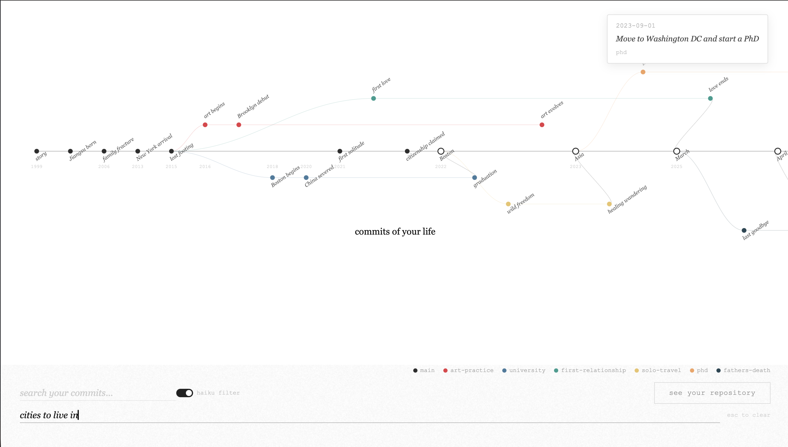

# Commits of Your Life

Your life as a git repository. Journal about your past, and watch it become commits, branches, and merges — a version-controlled life where nothing is deleted, only committed to.



Two modes:
- **Journal mode** — write about your life, AI agents extract events and generate a git repo with branches and merges
- **Discovery mode** — point it at your notes vault (Obsidian, markdown files), embed everything, then probe your past with questions like *"what was I afraid of?"* and watch related notes surface across different time periods

## Setup

### Prerequisites

- Python 3.9+
- git
- An [Anthropic API key](https://console.anthropic.com/)

### Install

```bash
git clone https://github.com/zorache/commits-of-your-life.git
cd commits-of-your-life

python3 -m venv venv
source venv/bin/activate
pip install -r requirements.txt
```

### Configure

Create a `.env` file in the project root:

```
ANTHROPIC_API_KEY=sk-ant-...
```

### Run

```bash
source venv/bin/activate
python app.py
```

Open [http://localhost:5000](http://localhost:5000).

Click the title, enter your name, write about your life, and hit "look back." The multi-agent pipeline (~50s first run, instant on repeat via cache) generates a git repo. You'll see a branch visualization you can scroll through, click commits, and download the repo as a zip.

## Discovery mode (optional)

Discovery mode lets you search your personal notes vault semantically. It requires ingesting your notes into a local ChromaDB vector store.

### 1. Ingest your vault

```bash
source venv/bin/activate
python discover.py ingest /path/to/your/notes
```

This walks all `.md` and `.txt` files, chunks them, and embeds them using `nomic-embed-text-v1.5` (runs locally, ~270MB model download on first run). Progress is batched in groups of 100.

**Note:** On Apple Silicon, embedding runs on MPS (GPU). For very large vaults (10k+ files), this can cause memory pressure. If the system freezes, set `device = "cpu"` in `discover.py` line 42.

Check ingestion status:

```bash
python discover.py status
```

### 2. Use discovery

Navigate to [http://localhost:5000/discover](http://localhost:5000/discover) for the discovery UI, or use the CLI:

```bash
python discover.py probe "what did I believe about love?"
```

### 3. Probe from the journal visualization

After generating a repo in journal mode, you can click any commit dot to surface related notes from your vault (if ingested). The search is constrained to a ±30 day window around the commit's date.

Set a **probe question** in the footer input (e.g. *"what was I afraid of?"*) and click through different commits to see how the answer changes across time periods. Toggle the Haiku filter to use a fast LLM pass that filters out fiction, quotes, and loosely related results.

## Architecture

- `app.py` — Flask backend, all routes
- `agents.py` — 5-agent pipeline (extractor, branch architect, keyword tagger, date validator, merger) for journal parsing
- `discover.py` — embedding (nomic-embed-text-v1.5), ChromaDB ingestion, vault probing with Claude synthesis
- `visualize.py` — extracts graph data from generated git repos for the SVG visualization
- `templates/index.html` — journal mode frontend
- `templates/discover.html` — discovery mode frontend

### Key dependencies

| Package | Purpose |
|---|---|
| `anthropic` | Claude API (sonnet for agents, haiku for filtering) |
| `chromadb` | Local vector store |
| `sentence-transformers` | Local embedding model |
| `GitPython` | Git repo creation |
| `flask` | Web server |

## Project context

This project stems from the hope that AI could help us understand ourselves better — to have autonomy over our own evolution, and to tell our own stories.

*How would you write down the timeline of your own life? Would it have many branches? Would you want to revert to a certain point?*
